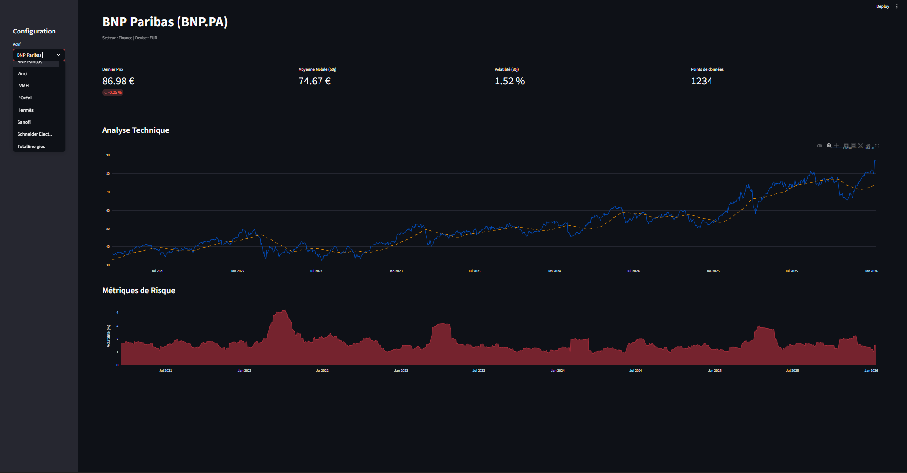

# CAC40 Risk Monitor

# CAC40 Risk Monitor

> **Projet Data Engineering** : Pipeline ETL automatisé et Dashboard de surveillance des risques financiers.


*Vue du Dashboard interactif : Analyse technique et métriques de volatilité

Ce projet est un pipeline de données (ETL) conçu pour automatiser la surveillance du risque financier des dix plus grandes entreprises du CAC40:
(BNP, LVMH, TotalEnergies, L'Oréal, Hermès, Sanofi, Airbus, Schneider, Air Liquide, Vinci)

Il a été réalisé dans le cadre d'un projet personnel en Data Engineering afin de mettre en pratique les concepts d'infrastructure de données, de conteneurisation et de traitement automatisé.

## Objectifs du Projet

L'objectif n'est pas uniquement l'analyse financière, mais la construction d'une architecture logicielle robuste capable de :
* Récupérer automatiquement des données boursières quotidiennes via une API.
* Traiter et nettoyer ces données (calcul de volatilité et moyennes mobiles).
* Stocker l'historique dans une base de données relationnelle structurée.
* Visualiser les indicateurs clés via une interface web.

## Architecture Technique

Le projet repose sur une architecture entièrement conteneurisée avec Docker, composée de trois services distincts :

1.  **Base de Données (PostgreSQL)**
    Stockage persistant des données. Le schéma relationnel sépare les informations statiques des entreprises et l'historique des cours.

2.  **ETL (Python)**
    Script responsable du cycle de vie de la donnée :
    * **Extraction** : Connexion à l'API Yahoo Finance.
    * **Transformation** : Calcul vectorisé des indicateurs de risque avec Pandas.
    * **Chargement** : Insertion incrémentale en base de données (seules les nouvelles données sont ajoutées).

3.  **Dashboard (Streamlit)**
    Interface de visualisation connectée à la base de données pour afficher les courbes de prix et de volatilité.

## Stack Technique

* **Docker & Docker Compose** : Pour garantir la portabilité de l'environnement et l'orchestration des services.
* **PostgreSQL 15** : Système de gestion de base de données relationnelle (SGBD).
* **Python 3.11** : Langage principal pour le script ETL.
* **Pandas & SQLAlchemy** : Manipulation des données et interaction avec la base SQL.
* **Streamlit** : Framework pour la création rapide d'interfaces de données.

## Installation et Démarrage

### Prérequis
* Docker Desktop
* Git

### Instructions

1.  **Cloner le dépôt**
    ```bash
    git clone https://github.com/mohamadou-laminou/cac40_pipeline.git
    cd cac40-risk-monitor
    ```

2.  **Configuration**
    Créer un fichier `.env` à la racine du projet pour définir les accès à la base de données :
    ```text
    POSTGRES_USER=admin
    POSTGRES_PASSWORD=password
    POSTGRES_DB=finance_db
    ```

3.  **Lancement**
    Exécuter la commande suivante pour construire les images et démarrer les conteneurs :
    ```bash
    docker-compose up -d --build
    ```
    *Note : L'orchestration est configurée pour que le script ETL et le Dashboard attendent que la base de données soit totalement opérationnelle avant de démarrer.*

4.  **Accès**
    Le Dashboard est accessible à l'adresse : http://localhost:8501

## Pistes d'amélioration (Roadmap)

Ce projet constitue une première version fonctionnelle (V1). Les évolutions suivantes sont envisagées :
* Mise en place d'Apache Airflow pour une orchestration plus complexe.
* Ajout de tests unitaires pour fiabiliser les calculs financiers.
* Intégration d'un pipeline CI/CD pour automatiser les déploiements.

---
**Auteur** : Laminou Mohamadou- Étudiant Ingénieur à l'EPF Montpellier